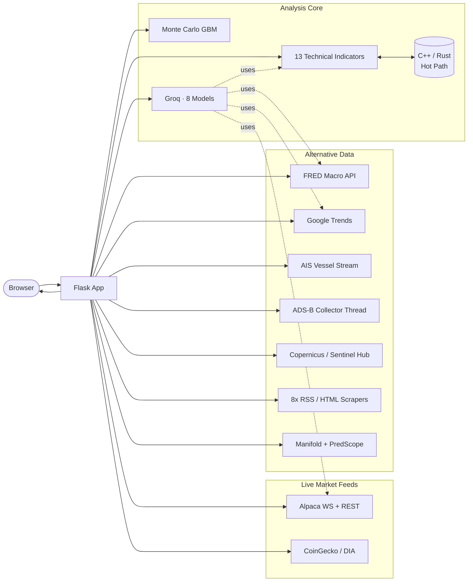

<div align="center">


$${\color{red}\textbf{S}}\text{tatistical }{\color{red}\textbf{T}}\text{rend }{\color{red}\textbf{A}}\text{nalysis and }{\color{red}\textbf{R}}\text{isk }{\color{red}\textbf{F}}\text{orecasting through }{\color{red}\textbf{I}}\text{ntelligent }{\color{red}\textbf{S}}\text{ignal }{\color{red}\textbf{H}}\text{euristics}$$

<a href="#-features">

</a>

<br/>


**Equities · Crypto · AI Trading Desk · Monte Carlo Simulation · Prediction Markets · Macro Data · Live News · Satellite Intelligence · AIS Vessels · ADS-B Aircraft**

*A single-file, full-stack market intelligence platform: real-time Alpaca/CoinGecko price feeds, an 8-model Groq AI trading desk, Geometric Brownian Motion risk simulation, a prediction-market consensus engine, live FRED macroeconomics, Google Trends sentiment, AIS shipping, ADS-B flight tracking, and a Sentinel-2 satellite viewer — accelerated by JIT-compiled C++ and Rust hot paths.*

[Features](#-features) · [Architecture](#-architecture) · [Installation](#-installation) · [Configuration](#-configuration) · [API Reference](#-api-reference) · [Native Acceleration](#-native-acceleration-layer)

</div>

<br/>

## 📡 Overview

STARFISH is a self-contained Flask application that fuses **live trading data, AI reasoning, and alternative data signals** into a single dark-themed dashboard. It tracks both US equities (via Alpaca's paper-trading feed) and a 30-asset crypto watchlist (via CoinGecko) side by side, runs an 8-model AI analysis desk on top of Groq's inference API, simulates forward price risk with a Geometric Brownian Motion engine, aggregates real-money prediction-market consensus, and layers in macro data, sector news, satellite imagery, shipping traffic, and live flight tracking — the kind of alternative data stack institutional desks pay for.

The entire platform ships as **one Python file**, with zero database and zero frontend build step. On first run, it silently attempts to JIT-compile native C++ and Rust extensions for its hottest math (EMA, RSI, OBV, tile projection) and falls back to pure pandas/NumPy if a compiler isn't present — so it runs anywhere, and runs faster where it can.

<br/>

## ✨ Features

<table>
<tr>
<td width="33%" valign="top">

**📈 Live Markets**
- 12-stock Alpaca watchlist
- 30-asset crypto watchlist
- WebSocket sub-second feed
- Candlestick + Line charts
- 13 technical indicators

</td>
<td width="33%" valign="top">

**🧠 AI & Risk**
- 8 Groq models on tap
- Streaming follow-up chat
- Monte Carlo GBM simulator
- Prediction-market consensus
- SPY correlation context

</td>
<td width="33%" valign="top">

**🛰️ Alternative Data**
- Sentinel-2 satellite viewer
- AIS live vessel tracking
- ADS-B live aircraft tracking
- FRED macro + Baltic Dry
- Google Trends sentiment

</td>
</tr>
</table>

---

### 1 · Real-Time Equities — Alpaca Paper Trading Feed

A curated 12-symbol watchlist streamed live from Alpaca's paper-trading market data API, spanning Technology, Finance, Consumer, Automotive, Healthcare, and a broad-market ETF:

<details>
<summary><b>View the 12-symbol watchlist</b></summary>

| Symbol | Name | Sector |
|---|---|---|
| `AAPL` | Apple Inc. | Technology |
| `MSFT` | Microsoft Corp. | Technology |
| `GOOGL` | Alphabet Inc. | Technology |
| `NVDA` | NVIDIA Corp. | Technology |
| `META` | Meta Platforms | Technology |
| `AMZN` | Amazon.com Inc. | Consumer |
| `WMT` | Walmart Inc. | Consumer |
| `TSLA` | Tesla Inc. | Automotive |
| `JPM` | JPMorgan Chase | Finance |
| `V` | Visa Inc. | Finance |
| `JNJ` | Johnson & Johnson | Healthcare |
| `SPY` | S&P 500 ETF | ETF |

</details>

Each quote resolves through a **4-tier live-price waterfall**, always preferring the freshest available source:

```
1. Alpaca WebSocket   (sub-second trade feed)        → data_type = LIVE
2. Alpaca REST        /stocks/trades/latest           → data_type = TRADE
3. Alpaca REST        /stocks/quotes/latest            → data_type = QUOTE
4. Alpaca REST        /stocks/bars/latest               → data_type = BAR
   ↳ yfinance fast_info                                   (final fallback)
```

The grid filters by sector (`ALL · TECH · FINANCE · CONSUMER · AUTO · HEALTH · ETF`) and exposes a live paper-trading account summary (`equity`, `cash`, `buying_power`, `portfolio_value`) via `/api/alpaca-account`.


---

### 2 · Live Crypto — 30-Asset CoinGecko Watchlist

A 30-coin watchlist spanning Layer 0/1/2 chains, DeFi, Oracles, and meme assets, refreshed every 10 seconds with live price, 24h change, market cap, and volume — plus a real 24-hour hourly sparkline per coin via `/api/crypto-sparkline`.

<details>
<summary><b>View all 30 tracked coins</b></summary>

| Category | Assets |
|---|---|
| **Layer 0** | Polkadot · Cosmos |
| **Layer 1** | Bitcoin · Ethereum · Solana · BNB · XRP · Cardano · TRON · Avalanche · Litecoin · Bitcoin Cash · Sui · Aptos · NEAR Protocol · Filecoin · Hedera · Ethereum Classic · Stellar · Internet Computer · Toncoin |
| **Layer 2** | Polygon · Arbitrum · Optimism |
| **DeFi** | Uniswap · Aave · Injective |
| **Oracle** | Chainlink |
| **Meme** | Dogecoin · Shiba Inu · Pepe |

</details>

The grid filters by category (`ALL · LAYER 1 · LAYER 2 · LAYER 0 · DEFI · ORACLE · MEME`) and sorts by price, 24h change, or market cap.

---

### 3 · Interactive Charting Engine

- **Candlestick & Line charts** rendered via Plotly with a custom theme, drag-to-pan and unified hover tooltips
- **13 indicators**: SMA (20/50/200), EMA, Bollinger Bands, RSI (14), MACD (12/26/9), ATR, OBV, Stochastic %K/%D, Williams %R, Chaikin Money Flow, ADX, VWAP, Ichimoku Cloud, plus rolling Support/Resistance
- **Time range selector**: 1M · 3M · 6M · 1Y · 2Y · 5Y
- **USD and INR currency detection** — auto-appends `.NS` for NSE / `.BO` for BSE tickers
- Indicator math is **natively accelerated** — see [Native Acceleration Layer](#-native-acceleration-layer)

---

### 4 · AI Trading Desk — 8 Groq Models

Eight Groq-hosted models, selectable per analysis, each fed the same structured financial brief — OHLCV, 13 technical indicators, FRED macro, Google Trends, fundamentals, shipping context, and a real-time price snapshot pulled from the same Alpaca waterfall used by the equities grid:

| Model | API ID | Profile |
|---|---|---|
| Llama 3.3 70B | `llama-3.3-70b-versatile` | Fast & balanced · 131K ctx |
| Llama 3.1 8B | `llama-3.1-8b-instant` | Fastest · 560 t/s · 131K ctx |
| Llama 4 Scout | `llama-4-scout-17b-16e-instruct` | 750 t/s · vision · 131K ctx |
| Qwen3 32B | `qwen3-32b` | Reasoning · 400 t/s · 131K ctx |
| GPT-OSS 20B | `gpt-oss-20b` | Fastest OSS · 1000 t/s · 131K ctx |
| GPT-OSS 120B | `gpt-oss-120b` | Flagship OSS · 500 t/s · 131K ctx |
| Groq Compound | `groq/compound` | Agentic · web search · code exec |
| Compound Mini | `groq/compound-mini` | Agentic · fast · tool-enabled |

Every analysis can be followed up with **plain-text chat** (`/api/ai-followup`) that stays grounded in a *fresh* live-price snapshot and the prior structured analysis — the model is explicitly instructed never to estimate a price it can't verify. Each model gets its own sliding-window rate limiter (30 RPM / 1,000 RPD).


---

### 5 · Monte Carlo Price Simulation (GBM)

A Geometric Brownian Motion engine calibrated on real historical data: drift (μ) and volatility (σ) are derived from two years of daily log returns pulled live via yfinance, then projected forward 1–10 years across up to 1,000 simulated paths.

```
S(t+dt) = S(t) · exp[(μ − ½σ²)·dt + σ·√dt·Z]      Z ~ N(0, 1)
```

The response returns the full percentile band (`p5 · p25 · p50 · p75 · p95`) and a sample of up to 80 simulated paths for fan-chart rendering.

---

### 6 · Prediction Market Consensus

Searches real-money and play-money prediction markets concurrently and ranks results by exact title match, then deviation from 50%, then volume:

- **[Manifold Markets](https://manifold.markets)** — live YES probabilities via `search-markets`
- **PredScope** (Polymarket-based aggregator) — best matching outcome per market

Useful as a sanity-check against the AI desk's own read on an event or ticker-adjacent question.

---

### 7 · Real-Time Macro Data (FRED)

Nine macro series pulled from the official St. Louis Fed REST API, fetched concurrently and cached for one hour:

| Series ID | Metric |
|---|---|
| `DFF` | Fed Funds Rate (%) |
| `CPIAUCSL` | CPI YoY (%) |
| `UNRATE` | Unemployment Rate (%) |
| `GDP` | Real GDP QoQ (%) |
| `T10Y2Y` | 10Y–2Y Yield Spread (bps) |
| `DTWEXBGS` | USD Trade-Weighted Index |
| `VIXCLS` | VIX Volatility Index |
| `BAMLH0A0HYM2` | High-Yield Credit Spread (%) |
| `MORTGAGE30US` | 30-Year Mortgage Rate (%) |

---

### 8 · Live News Aggregation

Eight financial RSS/HTML sources scraped concurrently and de-duplicated, filtered by sector-specific keyword sets across 11 GICS-aligned sectors:

`Yahoo Finance · CNBC · MarketWatch · Benzinga · Financial Times · Wall Street Journal · Reuters · Seeking Alpha`


---

### 9 · Shipping & Macro Context

- **Baltic Dry Index (BDI)** — scraped as a global trade proxy
- **AIS live vessel tracking** — `aisstream.io` WebSocket feed, rendered on a full-screen Leaflet map with Start/Stop control and freehand region selection
- **Major port monitoring**: Houston, Los Angeles, Rotterdam, Singapore, Shanghai


---

### 10 · Live Aircraft Tracker (ADS-B)

A background collector thread polls [adsb.lol](https://api.adsb.lol) every 5 seconds, rotating through **12 global regions** (North America, Europe, East Asia, South Asia, Australia, Russia/Central Asia, Middle East, Africa, South America, North Atlantic, Japan/Korea, SE Asia), buffering the latest 5,000 aircraft rows in a thread-safe ring buffer and appending each poll to `live_adsb_append.csv` on disk.

The `/aircraft` page renders this feed live on a Leaflet map — with type filtering, freehand region selection, and start/stop control identical to the vessel tracker — and proxies through `/adsb/proxy`, which transparently falls back to the buffered CSV data if the upstream API rejects a request, so the map never goes blank.

---

### 11 · Satellite Intelligence Layer

Each of the 11 GICS sectors includes **30 curated latitude/longitude targets** — refineries, steel mills, auto plants, airports, ports — for cross-referencing with the live satellite viewer below.


---

### 12 · Live Sentinel-2 Satellite Viewer (Copernicus)

A fully interactive satellite imagery viewer powered by the **Copernicus Data Space Ecosystem (CDSE)** and **Sentinel Hub Process API**:

- **5 spectral layers**: True Color · False Color · NDVI (vegetation) · SWIR (soil/burn) · Geology
- **Date range + cloud-cover filter** (0–100%), using `mosaickingOrder: leastCC`
- **Leaflet XYZ tile proxy** — each tile rendered server-side via `/sentinel/proxy-tile`, with the tile→bbox math running through the same native C++/Rust acceleration as the indicators
- **Location search** via Nominatim (OpenStreetMap)
- **Automatic OAuth2 token refresh** (27-minute cycle) — no manual re-auth


---

### 13 · Google Trends Sentiment

Pulls 3-month search interest via `pytrends` for each ticker's company name and symbol, returning current score, 30-day average, peak, and trend direction.

---

## 🏗️ Architecture



<details>
<summary><b>Expand the module / function tree</b></summary>

```
STARFISH (starfish.py)
│
├── Flask App (app)
│   ├── GET/POST  /                      → Main dashboard
│   ├── GET       /api/alpaca-stocks     → Live equities watchlist
│   ├── GET       /api/alpaca-crypto     → Live crypto watchlist
│   ├── GET       /api/crypto-sparkline  → 24h hourly coin prices
│   ├── GET       /api/alpaca-account    → Paper-trading account summary
│   ├── POST      /api/ai-analysis       → 8-model Groq AI analysis
│   ├── POST      /api/ai-followup       → Grounded follow-up chat
│   ├── POST      /api/gbm               → Monte Carlo GBM simulation
│   ├── GET       /api/prediction-markets→ Manifold + PredScope consensus
│   ├── GET       /api/rate-limits       → Per-model rate-limit status
│   ├── GET       /api/live-id           → YouTube live video ID lookup
│   ├── GET       /api/news              → Sector news aggregation
│   ├── GET       /api/macro             → FRED + Baltic Dry data
│   ├── GET       /api/trends            → Google Trends query
│   ├── GET       /api/satellite         → Sector satellite targets
│   ├── GET       /api/ais-key           → AIS stream key status
│   ├── GET       /vessels               → Live AIS vessel tracker page
│   ├── GET       /aircraft              → Live ADS-B aircraft tracker page
│   ├── GET       /adsb/proxy            → ADS-B region proxy (buffered fallback)
│   ├── GET       /adsb/data             → Buffered ADS-B rows (JSON)
│   ├── GET       /sentinel/token-status → CDSE OAuth2 token info
│   ├── GET       /sentinel/geocode      → Nominatim location search
│   ├── GET       /sentinel/proxy-tile   → Sentinel Hub tile proxy (XYZ)
│   └── GET       /debug                 → Data source health check
│
├── Native Acceleration  (.starfish_accel/ — built lazily, background thread)
│   ├── starfish_cpp.cpp   → ema · rsi_wilder · atr_wilder · obv · stoch_k · xyz_bbox · adsb_count_valid
│   └── starfish_rs.rs     → ema_rs · rsi_rs · obv_rs · xyz_bbox_rs   (Rust takes priority when present)
│
├── Live Data Layer
│   ├── alpaca_fetch_all_data()          → Equities watchlist (REST)
│   ├── get_alpaca_live_price()          → 4-tier live price waterfall
│   ├── _alpaca_ws_thread()              → Sub-second WebSocket trade feed
│   ├── alpaca_fetch_crypto_data()       → CoinGecko crypto watchlist
│   ├── coingecko_fetch_crypto_data()    → CoinGecko simple/price batch
│   ├── dia_fetch_crypto_data()          → DIA Data secondary quote engine
│   ├── fetch_yfinance_data()            → OHLCV via Yahoo Finance (v8/v7/lib fallback)
│   ├── fetch_all_macro()                → FRED macro series (concurrent)
│   ├── fetch_all_news()                 → 8-source RSS/HTML aggregation
│   ├── fetch_google_trends()            → pytrends 3-month interest
│   ├── fetch_shipping_context()         → AIS + port context
│   ├── _adsb_collector()                → Background ADS-B polling thread
│   └── TokenManager                     → CDSE OAuth2 auto-refresh (27-min cycle)
│
├── Technical Analysis (13 Indicators — Rust > C++ > pandas fallback)
│   ├── calc_sma() · calc_ema() · calc_bb() · calc_rsi() · calc_macd()
│   ├── calc_atr() · calc_obv() · calc_stoch() · calc_williams_r()
│   ├── calc_cmf() · calc_adx() · calc_vwap() · calc_ichimoku()
│   └── calc_support_resistance()
│
├── AI Pipeline
│   ├── build_analysis_payload()         → Assemble structured data dict
│   ├── build_prompt()                   → Construct LLM prompt string
│   ├── call_groq() / call_groq_plaintext() → Groq chat-completions calls
│   └── rl_check() / rl_record()         → Sliding-window rate limiter
│
├── Risk Simulation
│   └── run_gbm()                        → Calibrated Monte Carlo GBM engine
│
└── Chart Renderer
    └── build_chart()                    → Plotly subplots (Price + Vol + RSI + MACD)
```

</details>

---

## ⚡ Native Acceleration Layer

On import, STARFISH spins up a background thread that attempts to JIT-compile two native extensions into a local `.starfish_accel/` cache — **completely non-blocking**, so the server is already serving requests while the build runs:

```bash
# C++ (if g++ available)
g++ -O3 -march=native -ffast-math -shared -fPIC -std=c++17 -o starfish_cpp.so starfish_cpp.cpp

# Rust (if rustc available)
rustc --edition 2021 -O --crate-type cdylib -o starfish_rs.so starfish_rs.rs
```

Every hot indicator function resolves through a **Rust → C++ → pure-Python** priority chain at call time, so the app degrades gracefully with zero configuration:

| Function | Rust | C++ | Pure-Python fallback |
|---|:---:|:---:|---|
| EMA | ✅ | ✅ | `ewm(span=w, adjust=False)` |
| RSI (Wilder) | ✅ | ✅ | EWMA gain/loss ratio |
| OBV | ✅ | ✅ | `np.sign(diff) · cumsum` |
| ATR (Wilder) | — | ✅ | True-range EWMA |
| Stochastic %K | — | ✅ | Rolling high/low normalization |
| XYZ tile → WGS-84 bbox | ✅ | ✅ | `math.atan(math.sinh(...))` |
| ADS-B valid-row filter | — | ✅ | n/a (Python-only path) |

Neither compiler being present is **not an error** — the app logs `[ACCEL] ... using pure Python` and runs entirely on pandas/NumPy.

---

## 🚀 Installation

### Prerequisites
- Python 3.9+
- pip
- *(optional, for native acceleration)* `g++` and/or `rustc`

### Quick Start

```bash
# 1. Clone the repository
git clone https://github.com/yourusername/starfish.git
cd starfish

# 2. Install dependencies
pip install flask requests numpy pandas yfinance plotly httpx beautifulsoup4 lxml pytrends fredapi websocket-client

# 3. Set environment variables (see Configuration below)
export GROQ_API_KEY="your_groq_key"
export ALPACA_API_KEY="your_alpaca_key"        # optional — equities feed
export ALPACA_SECRET_KEY="your_alpaca_secret"  # optional — equities feed
export FRED_API_KEY="your_fred_key"            # optional — macro data
export AISSTREAM_API_KEY="your_aisstream_key"  # optional — vessel tracking

# 4. Run the server
python starfish.py
```

Open your browser at **http://127.0.0.1:5000**

---

## ⚙️ Configuration

### Environment Variables

| Variable | Required | Description |
|---|---|---|
| `GROQ_API_KEY` | **Yes** (for AI) | [Groq](https://groq.com) API key powering the 8-model AI trading desk |
| `ALPACA_API_KEY` / `ALPACA_SECRET_KEY` | No | [Alpaca](https://alpaca.markets) paper-trading keys for the live equities feed and account panel |
| `FRED_API_KEY` | No | [FRED](https://fred.stlouisfed.org) API key for macro data (empty key degrades gracefully) |
| `COINGECKO_API_KEY` | No | CoinGecko Pro key — switches the base URL to the Pro endpoint; falls back to the public API otherwise |
| `AISSTREAM_API_KEY` | No | [AISStream.io](https://aisstream.io) key for live vessel tracking |
| `CDSE_USERNAME` / `CDSE_PASSWORD` | No | Copernicus Data Space credentials, for the Sentinel-2 satellite viewer |

### Cache TTLs

```python
ALPACA_CACHE_TTL   = 15    # seconds — Alpaca equities watchlist
CRYPTO_CACHE_TTL    = 10    # seconds — CoinGecko crypto watchlist
_FRED_CACHE_TTL     = 3600  # 1 hour  — FRED macro data
_TRENDS_CACHE_TTL   = 1800  # 30 min  — Google Trends
_AIS_CACHE_TTL       = 600   # 10 min  — AIS shipping context
_REFRESH_INTERVAL    = 1620  # 27 min  — CDSE OAuth2 token
```

---

## 📡 API Reference

<details open>
<summary><b>AI Trading Desk</b></summary>

#### `POST /api/ai-analysis`

```json
{
  "ticker":   "AAPL",
  "period":   "6mo",
  "model_id": "llama-3.3-70b-versatile"
}
```

**Response**
```json
{
  "ticker":       "AAPL",
  "period":       "6mo",
  "model_id":     "llama-3.3-70b-versatile",
  "analysis":     "## Technical Analysis\n...",
  "data_sources": [
    "Real-Time Price (Alpaca WebSocket · LIVE)",
    "FRED Macro (9 series)",
    "Google Trends (3 keywords)",
    "Yahoo Fundamentals",
    "AIS Shipping Context",
    "12 Technical Indicators",
    "30-Day OHLCV Chart",
    "Candlestick Pattern Analysis",
    "SPY Correlation"
  ]
}
```

**Error codes:** `400` bad input · `404` no data · `429` rate limited · `500` server error · `502` upstream error

#### `POST /api/ai-followup`

Grounded plain-text follow-up chat on a completed analysis.

```json
{
  "ticker": "AAPL",
  "period": "6mo",
  "model_id": "llama-3.3-70b-versatile",
  "question": "What's the immediate downside risk?",
  "history": [{"role": "user", "content": "..."}],
  "context": { "...prior structured analysis..." : true }
}
```

#### `GET /api/rate-limits`

```json
{
  "llama70b": { "rpm_used": 3, "rpm_max": 30, "rpd_used": 47, "rpd_max": 1000, "available": true, "rpm_reset_secs": 42 }
}
```

</details>

<details>
<summary><b>Equities & Crypto</b></summary>

#### `GET /api/alpaca-stocks`
Live data for the 12-symbol equities watchlist.

#### `GET /api/alpaca-crypto`
Live data for the 30-asset crypto watchlist (CoinGecko).

#### `GET /api/crypto-sparkline?id=bitcoin`
24-hour hourly price series for a single CoinGecko coin ID.

#### `GET /api/alpaca-account`
```json
{ "equity": "100000.00", "cash": "50000.00", "buying_power": "200000.00", "portfolio_value": "100000.00", "status": "ACTIVE" }
```

</details>

<details>
<summary><b>Risk & Markets</b></summary>

#### `POST /api/gbm`

```json
{ "ticker": "AAPL", "n_years": 2, "n_scenarios": 200 }
```

**Response**
```json
{
  "ticker": "AAPL", "s_0": 192.34, "mu": 0.1421, "sigma": 0.2873,
  "n_years": 2, "n_scenarios": 200,
  "t_axis": [0, 0.004, "..."],
  "paths": [["..."]],
  "terminal": ["..."],
  "percentiles": { "p5": 140.2, "p25": 175.8, "p50": 205.1, "p75": 240.6, "p95": 298.4 }
}
```

#### `GET /api/prediction-markets?q=fed%20rate%20cut`

```json
{
  "results": [
    { "platform": "Manifold", "title": "Will the Fed cut rates in March?", "market_id": "...", "url": "...", "probability": 62.0, "outcome_label": "YES", "volume": 18230 }
  ],
  "sources": 2, "query": "fed rate cut"
}
```

</details>

<details>
<summary><b>Macro, News & Sectors</b></summary>

#### `GET /api/macro`
```json
{
  "macro": { "DFF": { "label": "Fed Funds Rate (%)", "value": 5.33, "date": "2025-04-01", "change": 0.0 } },
  "baltic_dry": { "value": 1420, "date": "2025-04-22", "source": "BDI" },
  "timestamp": "2025-04-22T10:30:00"
}
```

#### `GET /api/news?sector=energy`
Valid sector IDs: `energy · materials · industrials · consumer-discretionary · consumer-staples · health-care · financials · information-technology · communication-services · real-estate · utilities`

#### `GET /api/satellite?sector=energy`
Returns 30 curated lat/lon targets for the sector.

#### `GET /api/trends?q=NVDA`
3-month Google Trends interest for a query.

#### `GET /api/live-id?handle=@handle`
Active YouTube live-stream video ID for a channel handle.

</details>

<details>
<summary><b>Live Trackers — Vessels & Aircraft</b></summary>

#### `GET /vessels`
Full-page AIS vessel tracking map (requires `AISSTREAM_API_KEY`).

#### `GET /api/ais-key`
Same-origin AIS key status check (never exposed in public HTML).

#### `GET /aircraft`
Full-page ADS-B live aircraft tracking map.

#### `GET /adsb/proxy?lat=&lon=&dst=`
Region-based ADS-B proxy; falls back to the buffered ring-deque if the upstream API rejects the request.

#### `GET /adsb/data?limit=500`
```json
{ "count": 500, "columns": ["ts","hex","flight","lat","lon","alt_baro","gs","track"], "rows": ["..."] }
```

</details>

<details>
<summary><b>Live Satellite Imagery</b></summary>

#### `GET /sentinel/token-status`
```json
{ "fetched_at": "10:32:01 UTC", "expires_at": "11:01:01 UTC", "remaining_seconds": 1734, "token_prefix": "eyJhbGciOiJSU…" }
```

#### `GET /sentinel/geocode?q=Rotterdam`
```json
{ "results": [{ "display_name": "Rotterdam, South Holland, Netherlands", "lat": "51.9225", "lon": "4.47917" }] }
```

#### `GET /sentinel/proxy-tile?layer=TRUE-COLOR&dateFrom=2025-01-01&dateTo=2025-01-31&cloud=30&z=8&x=132&y=85`

| Param | Default | Description |
|---|---|---|
| `layer` | `TRUE-COLOR` | `TRUE-COLOR · FALSE-COLOR · NDVI · SWIR · GEOLOGY` |
| `dateFrom` / `dateTo` | — | Acquisition window (`YYYY-MM-DD`) |
| `cloud` | `30` | Max cloud coverage % (0–100) |
| `z`, `x`, `y` | — | Standard XYZ tile coordinates |

Returns a 512×512 PNG tile, or a 1×1 transparent fallback on error/no-data.

</details>

#### `GET /debug`
Health check: tests Yahoo Finance data fetch and FRED macro series.

---

## 🧮 Technical Indicators — Implementation Notes

| Indicator | Function | Formula Notes |
|---|---|---|
| SMA 20/50/200 | `calc_sma()` | `rolling(w).mean()` on Close |
| EMA | `calc_ema()` | `ewm(span=w, adjust=False).mean()` (native-accelerated) |
| Bollinger Bands | `calc_bb()` | SMA20 ± 2σ with fillcolor band |
| RSI (14) | `calc_rsi()` | Wilder smoothing via EWMA (native-accelerated) |
| MACD (12,26,9) | `calc_macd()` | EMA diff + signal + histogram |
| ATR (14) | `calc_atr()` | True Range: max(H−L, \|H−Cₚ\|, \|L−Cₚ\|) (C++-accelerated) |
| OBV | `calc_obv()` | Cumulative volume signed by price direction (native-accelerated) |
| Stochastic %K/%D | `calc_stoch()` | Rolling high/low normalization (C++-accelerated) |
| Williams %R | `calc_williams_r()` | Inverse stochastic |
| CMF (20) | `calc_cmf()` | MFV × Volume / Σ Volume |
| ADX (14) | `calc_adx()` | True directional movement via native EMA |
| VWAP | `calc_vwap()` | Cumulative (H+L+C)/3 × V / Cum V |
| Ichimoku | `calc_ichimoku()` | Tenkan (9), Kijun (26), Senkou A & B |
| Support/Resistance | `calc_support_resistance()` | Rolling min/max window peaks |

---

## 🔌 Data Sources

| Source | Data | Method |
|---|---|---|
| [Alpaca Markets](https://alpaca.markets) | Live equities + paper account | WebSocket + REST |
| [CoinGecko](https://coingecko.com) | Live crypto prices, market cap, sparkline | REST API |
| [Yahoo Finance](https://finance.yahoo.com) | OHLCV, fundamentals | Custom HTTP scraper (v8/v7/library fallback) |
| [FRED — St. Louis Fed](https://fred.stlouisfed.org) | 9 macro series | Public REST API |
| [Groq](https://groq.com) | LLM inference (8 models) | REST API |
| [Manifold Markets](https://manifold.markets) | Prediction-market probabilities | REST API |
| PredScope (Polymarket-based) | Prediction-market probabilities | REST API |
| [Google Trends](https://trends.google.com) | Search interest | `pytrends` |
| [AISStream.io](https://aisstream.io) | Live vessel positions | WebSocket API |
| [adsb.lol](https://api.adsb.lol) | Live aircraft positions | REST API (polled every 5s) |
| [Copernicus CDSE](https://dataspace.copernicus.eu) | Sentinel-2 L2A imagery | OAuth2 + Sentinel Hub Process API |
| [Nominatim / OSM](https://nominatim.openstreetmap.org) | Location geocoding | REST API |
| Yahoo Finance, CNBC, MarketWatch, Benzinga, FT, WSJ, Reuters, Seeking Alpha | Financial news | RSS/HTML scraping |
| Baltic Exchange | Shipping index (BDI) | Web scraping |

---

## 📦 Dependencies

```
flask
requests
numpy
pandas
yfinance
plotly
httpx
beautifulsoup4
lxml
pytrends
fredapi
websocket-client
```

Install all at once:
```bash
pip install flask requests numpy pandas yfinance plotly httpx beautifulsoup4 lxml pytrends fredapi websocket-client
```

> Native acceleration is optional and detected automatically — install `g++` and/or `rustc` on the host if you want the compiled hot paths; everything still works without them.

---

## 🛰️ Sectors & Satellite Targets

Each of the 11 GICS sectors carries 30 globally distributed satellite observation targets:

| Sector ID | Label | ETF Proxy | Key Assets |
|---|---|---|---|
| `energy` | Energy | XLE | Refineries, LNG terminals, oil rigs |
| `materials` | Materials | XLB | Copper mines, steel mills, cement plants |
| `industrials` | Industrials | XLI | Aircraft factories, auto plants, ports |
| `consumer-discretionary` | Consumer Discretionary | XLY | Retail HQs, malls, auto dealers |
| `consumer-staples` | Consumer Staples | XLP | Grocery HQs, food factories, QSR chains |
| `health-care` | Health Care | XLV | Pharma HQs, hospitals, biotech campuses |
| `financials` | Financials | XLF | Bank HQs, exchanges, fintech offices |
| `information-technology` | Information Technology | XLK | Chip fabs, hyperscale data centers |
| `communication-services` | Communication Services | XLC | Broadcast towers, streaming campuses |
| `real-estate` | Real Estate | XLRE | REIT portfolios, data center REITs |
| `utilities` | Utilities | XLU | Power stations, water treatment, grid |

---

## 🔒 Security Notes

- `GROQ_API_KEY`, `ALPACA_API_KEY`/`ALPACA_SECRET_KEY`, and `FRED_API_KEY` are read from environment variables and **never embedded in source code or HTML responses**
- `AISSTREAM_API_KEY` is served only via the same-origin `/api/ais-key` endpoint, never injected directly into public HTML
- Alpaca integration points exclusively at the **paper-trading** endpoint (`paper-api.alpaca.markets`) — no live capital is ever at risk
- All external requests include a realistic `User-Agent` header pool to avoid bot detection
- Session, crumb, and native-library caches are stored in-process memory / a local `.starfish_accel/` directory only — no external persistence

---

## 🧭 Yahoo Finance Scraper Notes

Yahoo Finance periodically changes its authentication flow. STARFISH implements a **3-tier fallback**:

1. **v8 API** — `/v8/finance/chart/` with crumb authentication
2. **v7 API** — `/v7/finance/download/` CSV endpoint
3. **yfinance library** — official Python library as last resort

Crumbs are refreshed automatically when they expire, and the session rotates through a pool of user agents.

---

## 🤝 Contributing

Contributions are welcome. Please:

1. Fork the repository
2. Create a feature branch: `git checkout -b feature/my-feature`
3. Make changes in `starfish.py` (or split into modules if refactoring)
4. Test your changes: `python starfish.py` → verify `/debug` passes
5. Submit a pull request with a clear description

### Areas for Contribution
- Add more models to the `AI_MODELS` list
- Add additional FRED series to `FRED_SERIES`
- Expand sector news sources
- Add more satellite targets per sector
- Wire `dia_fetch_crypto_data()` in as an active CoinGecko fallback
- Persistent caching (Redis / SQLite) in place of in-process dicts

---

## 📄 License

This project is licensed under the MIT License. See `LICENSE` for details.

---

## 🙏 Acknowledgements

- [Alpaca Markets](https://alpaca.markets) for the live equities feed and paper-trading account
- [CoinGecko](https://coingecko.com) for live crypto pricing
- [Groq](https://groq.com) for fast multi-model LLM inference
- [Yahoo Finance](https://finance.yahoo.com) for OHLCV data
- [FRED — Federal Reserve Bank of St. Louis](https://fred.stlouisfed.org) for macroeconomic series
- [Manifold Markets](https://manifold.markets) for prediction-market data
- [Plotly](https://plotly.com) for interactive charting
- [AISStream.io](https://aisstream.io) for vessel tracking
- [adsb.lol](https://api.adsb.lol) for open ADS-B aircraft data
- [Copernicus Data Space Ecosystem](https://dataspace.copernicus.eu) & ESA for Sentinel-2 satellite imagery
- [OpenStreetMap / Nominatim](https://nominatim.openstreetmap.org) for location geocoding

---

<div align="center">

*BUILT TO BEAT THE BENCHMARK.*


</div>
